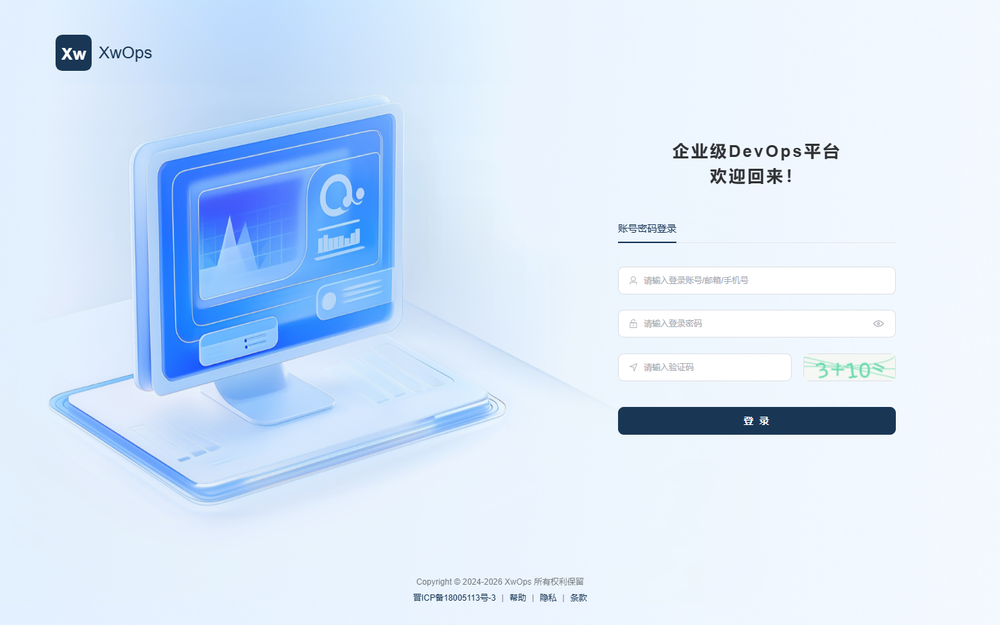
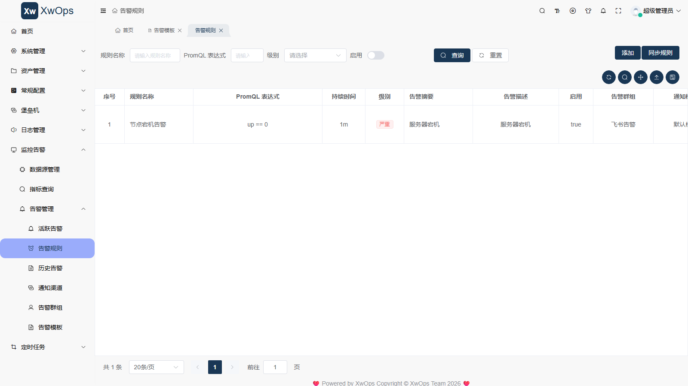
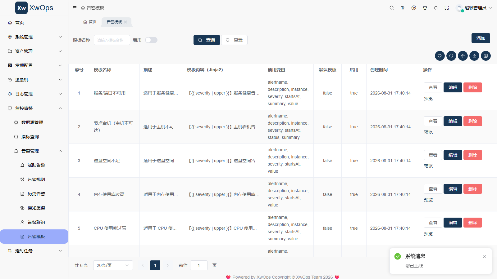

# XwOps — 自研企业级 DevOps 平台（基于 DVAdmin3 二次开发）

> 一个面向中小团队运维场景的 DevOps 一体化平台，覆盖 **CMDB 资产管理 + 堡垒机（Web SSH / 命令下发 / 会话录像 / 命令审计）+ 监控告警** 三大核心能力。
>
> 本仓库只包含 XwOps 在 DVAdmin3 基础上的 **二次开发业务代码** 与 **部署相关资源**（docker-compose、初始化 SQL、部署文档、运维小工具）。DVAdmin3 框架本身未包含在本仓库中（请从上游获取）。

---

## 一、功能特性

| 模块 | 能力 |
| ---- | ---- |
| 资产管理（CMDB） | 机房 / 环境 / 业务线 / 服务器四层建模，Excel 批量导入，状态与责任人维护 |
| 堡垒机 | Web SSH 终端、会话录像、命令审计、命令批量下发（CMDB 多选 / 手动 IP 兜底） |
| 监控告警 | Prometheus + Alertmanager + Webhook 分发，告警规则 / 通知模板 / 通知组 / 渠道（飞书 / 钉钉 / 企微 / 邮箱）解耦 |
| 系统管理 | 用户 / 角色 / 菜单 / 部门 / 字典 / 系统参数（沿用 DVAdmin3 标准 RBAC + fast-crud 前端） |

技术亮点：

- 命令下发同步执行：`paramiko` + `ThreadPoolExecutor` 批量 SSH，任务级统一凭证，失败可重试，全链路审计
- 告警渲染：Jinja2 模板 + 规则→模板关联，`is_default` 兜底模板，告警事件可预览
- 首页 Dashboard：CMDB / 会话 / 告警统计聚合 + 7 天告警趋势
- 部署灵活：自带 MySQL/Redis（场景 A）或 外接内网已有 MySQL/Redis（场景 B）

---

## 二、技术栈

| 层 | 技术 |
| -- | ---- |
| 后端 | Django 4.2 + DRF，DVAdmin3 框架（`dvadmin/`、`application/`、`conf/`） |
| 前端 | Vue3 + Vite + Element Plus + fast-crud 1.21.2 |
| 数据库 | MySQL 8.0（场景 A 自带容器；场景 B 可外接 MySQL 5.7/8.0） |
| 缓存 / 队列 | Redis 6.2.6 + Celery |
| 监控 | Prometheus + Alertmanager + node_exporter（**不随本平台部署，复用内网已有**） |
| 堡垒机 | paramiko（SSH 客户端）+ Channels（Web SSH） |
| 部署 | docker compose，5 个自定义镜像 + 1 个 Web 静态站点 |

---

## 三、仓库目录结构

```text
devops_system/
├── backend/                       # XwOps 二次开发的后端业务模块
│   ├── alert/                     #   监控告警（规则 / 模板 / 渠道 / 群组 / 事件 / webhook 接收）
│   ├── bastion/                   #   堡垒机（Web SSH consumers / 会话 / 命令审计 / 凭据加密）
│   ├── cmdb/                      #   资产管理（机房 / 环境 / 业务线 / 服务器 + Excel 导入命令）
│   ├── dispatch/                  #   命令下发（执行器 / SSH 客户端 / 任务模型 / 视图）
│   └── monitor/                   #   监控（Prometheus 数据源 / 查询代理 + init 命令）
├── frontend/                      # XwOps 二次开发的前端视图（每个目录对应一个业务模块）
│   ├── alert/ channel event group manage rule
│   ├── businessLine/ commandLog/ credential/ dispatch/
│   ├── environment/ home/ idc/ monitor/ server/ session/ webSsh/
│   └── brand/                     #   XwOps 自定义 LOGO / favicon（替换 DVAdmin3 默认品牌）
├── docker/                        # 镜像构建与配置
│   ├── django.Dockerfile          #   Django 运行环境镜像（不含业务代码，代码挂载）
│   ├── celery.Dockerfile          #   Celery worker 运行环境镜像
│   ├── web.Dockerfile              #   Web 静态站点镜像（nginx，已含编译后页面）
│   ├── prometheus.yml             #   部署包内携带的样例（不部署，仅供查阅）
│   └── alertmanager.yml           #   部署包内携带的样例（不部署，仅供查阅）
├── deploy/                        # 部署资源（完整说明见《部署文档.md》）
│   ├── docker-compose.yml         #   场景 A：自带 MySQL/Redis 五容器编排
│   ├── docker-compose.external.yml#   场景 B：外接已有 MySQL/Redis 三容器编排
│   ├── pack_deploy.sh             #   一键打包脚本（docker save 镜像 + 代码 + 数据）
│   ├── init/
│   │   ├── xwops_init.sql         #     场景 B 初始化 SQL（5.7/8.0 通用，已脱敏）
│   │   └── init_external.sh       #     内网建库 + 导数据脚本
│   ├── tools/
│   │   ├── reset_password.py      #     首次导入后重置 superadmin/admin/test 密码
│   │   ├── deploy_setup.sh        #     修改 backend/conf/env.py 的辅助脚本
│   │   ├── ssh_run.py             #     SSH 执行远程命令（开发期用）
│   │   ├── scp_up.py              #     单文件 SFTP 上传（开发期用）
│   │   ├── deploy_dir.py          #     目录递归上传（开发期用）
│   │   └── rebuild_web.py         #     流式重建 web 镜像（开发期用）
│   ├── 部署文档.md                 #   8 章小白向部署教程（含场景 A / 场景 B）
│   └── 部署清单.md                 #   部署文件清单 + 敏感信息标注
└── docs/
    └── screenshots/               #   README 引用的界面截图（已筛选不含敏感信息）
```

---

## 四、与 DVAdmin3 的关系

XwOps 完全基于 [DVAdmin3](https://github.com/liqianglog/django-vue3-admin) 进行二次开发，未修改其核心框架代码，所有定制都集中在以下两层：

1. **后端业务模块**（`backend/`）：5 个独立的 Django app（alert / bastion / cmdb / monitor / dispatch），每个 app 都是 DVAdmin3 的标准业务模块结构，可直接放进 DVAdmin3 后端的根目录。
2. **前端视图**（`frontend/`）：14 套 fast-crud 视图 + XwOps 自定义品牌（`brand/`），对应后端的业务模块。

要本地运行 XwOps 完整代码，需要：

1. 从 DVAdmin3 上游克隆完整后端（含 `dvadmin/`、`application/`、`conf/`、`requirements.txt`、`docker_start.sh` 等）；
2. 把本仓库的 `backend/*` 各 app 复制到上游后端根目录；
3. 把本仓库的 `frontend/*` 视图放到上游前端对应位置；
4. 按《部署文档.md》配置 `backend/conf/env.py` 与 `.env`。

> 实际生产部署推荐使用 `deploy/pack_deploy.sh` 走 **docker save/load 全量迁移** 路线，无需单独获取 DVAdmin3 框架。

---

## 五、部署

详细步骤见 [`deploy/部署文档.md`](deploy/部署文档.md)（小白向，含两条命令级别教程），文件清单见 [`deploy/部署清单.md`](deploy/部署清单.md)。

### 两条部署路径

| 场景 | 适用 | 关键文件 |
| ---- | ---- | -------- |
| **场景 A**：自带 MySQL/Redis | 新环境、无现成 MySQL/Redis | `deploy/docker-compose.yml` + `deploy/pack_deploy.sh` 一键打包 |
| **场景 B**：外接已有 MySQL/Redis | 内网已有 MySQL/Redis，仅部署应用层 | `deploy/init/xwops_init.sql` + `init/init_external.sh` + `deploy/docker-compose.external.yml` |

### 快速验证步骤（场景 A）

```bash
# 1. 一键打包（在本仓库 devops_system/ 目录下）
bash deploy/pack_deploy.sh
# 产出 deploy_package/images/*.tar + backend/ + docker_env/

# 2. 把整个 deploy_package/ 目录 rsync 到新服务器

# 3. 新服务器上
cd deploy_package
docker load -i images/*.tar
docker compose up -d

# 4. 首次登录前，先重置密码（SQL 中密码已脱敏）
docker exec -it dvadmin3-django python reset_password.py superadmin 你的新密码

# 5. 浏览器访问
# http://<新服务器IP>:8080
```

### 重要安全与脱敏说明

| 项 | 处理 |
| -- | ---- |
| 公网 / 内网 IP | 全部替换为 `YOUR_SERVER_IP` / `127.0.0.1` 等占位符 |
| SSH / MySQL / Redis 密码 | 全部替换为 `YOUR_SSH_PASSWORD` / `YOUR_MYSQL_PASSWORD` / `YOUR_REDIS_PASSWORD` |
| SuperAdmin 密码 | SQL 中 hash 替换为 `pbkdf2_sha256$600000$REPLACE_ME_SALT$REPLACE_ME_HASH` 占位，**首次部署后必须用 `reset_password.py` 重置** |
| Admin / Test 演示账号 | 同上，重置方式相同 |
| 飞书 webhook token | 替换为 `YOUR_WEBHOOK_TOKEN` |
| 系统默认密码配置（`base.default_password`） | 替换为 `YOUR_DEFAULT_PASSWORD` |
| 真实登录 / 操作日志 | 访问 IP 替换为 `127.0.0.1` |
| 堡垒机凭据（Fernet 加密密文） | 已从 SQL 中删除，部署后需在 Web 端重新添加 |
| 容器内部固定网段 `172.30.0.0/16` | 保留为占位示例，**不是真实内网网段**；若与内网冲突请改 |

> 截图也做了筛选：仅保留不含真实 IP / 凭据 / 服务器名等敏感信息的截图（登录页、告警规则列表、告警模板列表）。

---

## 六、界面预览

### 登录页



### 告警规则管理



### 告警模板管理



---

## 七、安全相关备忘

- 2026-08-31 完成 `superadmin` 默认密码整改（admin123456 → 强密码），并加固 `/api/init/settings/` 敏感接口与 `/api/init/dictionary/` 鉴权
- DVAdmin 密码机制：内部存的是 `pbkdf2_sha256(md5(password))` 双重哈希，`CustomBackend` 登录时先试原始密码再试 md5 兜底
- 修改用户密码正确姿势：`user.set_password(新密码); user.save(update_fields=['password'])`（DVAdmin 自动做 md5 再 pbkdf2）

---

## 八、协议

本仓库的 XwOps 业务代码部分按 MIT 协议开源。
DVAdmin3 框架部分遵循其上游协议（Apache-2.0）。